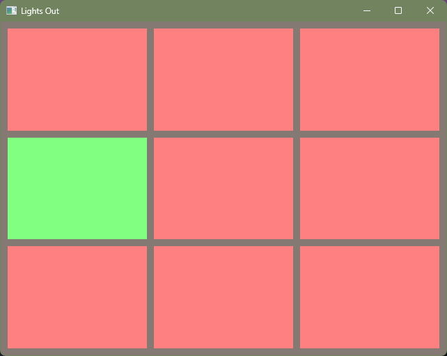

Destiny Lights Out
==================

In Destiny 2, there was a variation of the Lights out game where the goal is to make all of the lights the same color.

This is an implementation of this.

It uses the [piston](https://www.piston.rs/) game engine.



# building

Tested on rust version: `rustc 1.74.1 (a28077b28 2023-12-04)`

```
cargo build
```

# running

```
cargo run
```

# TODO

- create a main menu
- show rules for the game in the game window
- highlight cells on hover to show intent before clicks
- check library version and see if updates are worth it
- consider reimplementing in [Bevy](https://bevyengine.org/), 
  because that engine seems more intersting and this would be an easy thing to implement to learn that engine.
- there are no tests in this repo. 
